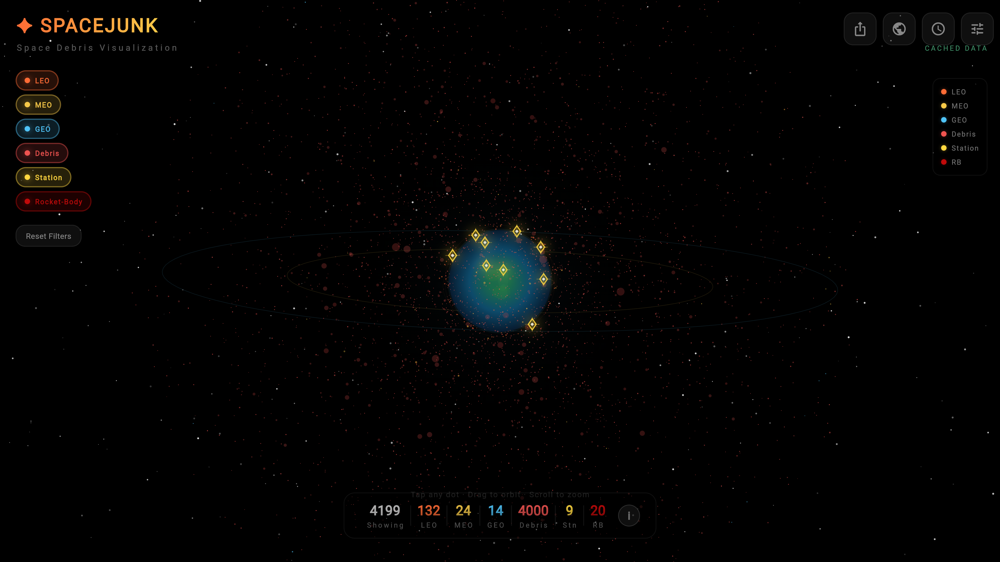
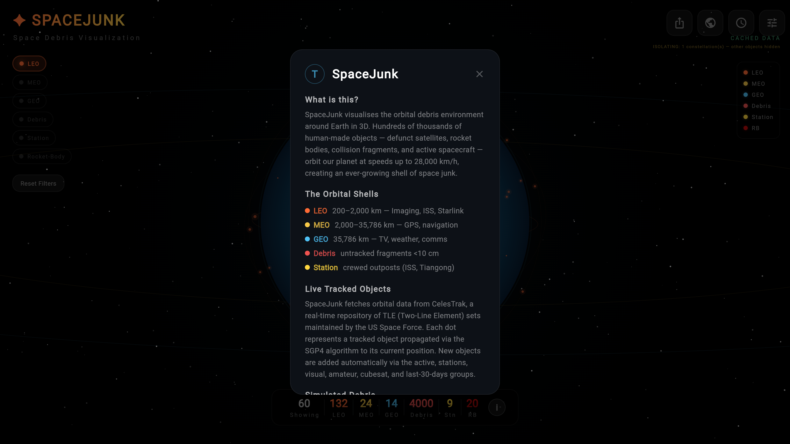
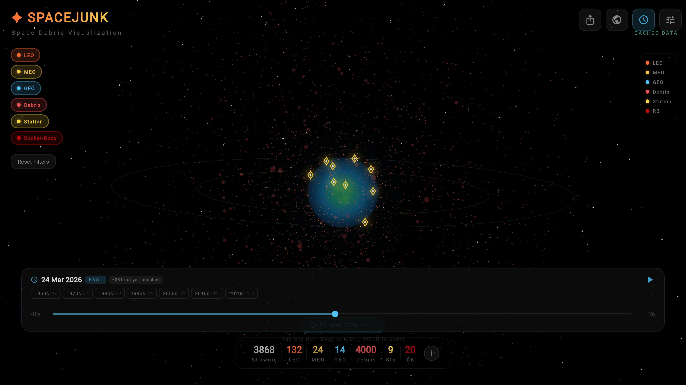
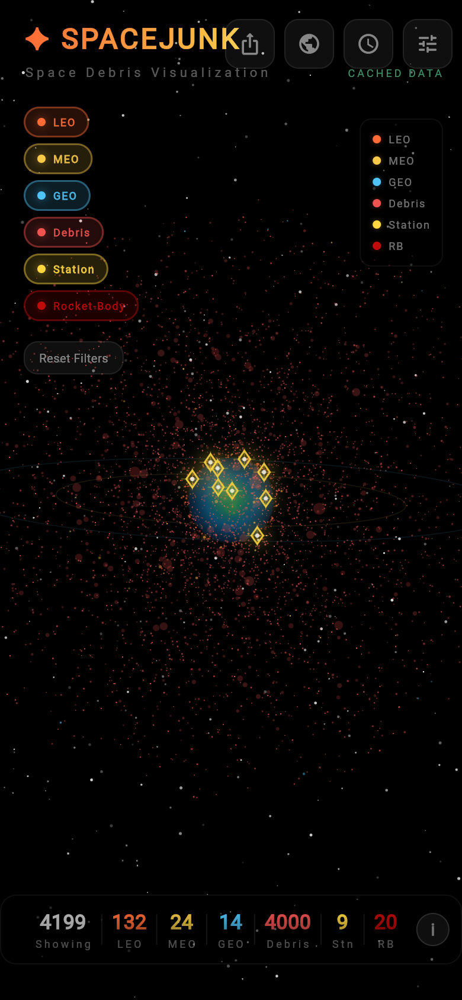

<p align="center">
  
</p>

<p align="center">
  <b>Interactive 3D visualization of space debris orbiting Earth</b><br>
  Built with Flutter • Live data from CelesTrak • SGP4 orbital propagation
</p>

<p align="center">
  
  
  
</p>

<p align="center">
  <b><a href="https://spacejunk.4ft.me">➜ See it live → spacejunk.4ft.me</a></b>
</p>

---

SpaceJunk renders the orbital debris environment around Earth in real-time 3D. Hundreds of thousands of human-made objects — defunct satellites, rocket bodies, collision fragments, and active spacecraft — orbit our planet at speeds up to 28,000 km/h. This app visualises them all in a single interactive view.

## ✨ Features

- **3D orbital view** — drag to orbit, pinch to zoom, auto-rotation with gyroscopic feel
- **Live tracked objects** — fetches current TLE data from [CelesTrak](https://celestrak.org), propagated via SGP4
- **Procedural debris** — ~4,000 simulated untracked fragments supplement live data for a complete picture
- **Orbital shells** — colour-coded layers: LEO (orange), MEO (yellow), GEO (cyan), Debris (red), Station (gold)
- **Reference rings** — equatorial and inclined rings at 400 km, 20,200 km, 35,786 km
- **Tap popups** — tap any object to see its name, shell, altitude, and data source
- **Historical scrubber** — slide through time (±1 year) with play/pause to watch orbital evolution
- **Filter panel** — toggle individual shells, show/hide starfield, all with tactile Cupertino-style switches
- **Quick-access pills** — one-tap shell toggles anchored to the left of the viewport
- **Constellation filter** — isolate satellites by group (Starlink, OneWeb, GPS, Iridium, etc.) with per-group toggles and object counts
- **Country filter** — isolate objects by country of origin with a searchable flag picker; stacks with all other filters
- **Station markers** — gold crosshair+ring markers for crewed outposts (ISS, Tiangong)
- **Info dialog** — learn about orbital shells, data sources, and the space debris problem

## 📸 Screenshots

| Default view | Constellation filter | Historical view |
|:---:|:---:|:---:|
|  |  |  |

| Mobile |
|:---:|
|  |

## 🚀 Getting Started

### Prerequisites

- [Flutter SDK](https://docs.flutter.dev/get-started/install) (3.x)
- Android device or emulator (for deployment)
- A [CelesTrak](https://celestrak.org) account is **not** required — data is freely accessible

### Run on Android

```bash
cd spacejunk
flutter run -d <device-id>
```

### Release build

```bash
flutter build apk --release
flutter install -d <device-id>
```

### Run on Web

```bash
# Standard build
flutter build web --release

# With WebAssembly + CanvasKit (better performance for 3D graphics)
flutter build web --release --wasm
```

Serve the `build/web` directory via any static file server (GitHub Pages, Vercel, Netlify, etc.).

> **Data sources (priority order):** 1) Self-hosted TLE cache at `/api/tle.json`
> (same-origin on web, absolute URL on mobile), 2) CelesTrak direct + CORS proxies
> (client-side), 3) procedural simulation (always works). The self-hosted cache is
> refreshed periodically from CelesTrak and includes SATCAT metadata for enriched
> tap popups on all platforms.

## 🧭 Orbital Shells

| Shell | Altitude | Colour | Description |
|-------|----------|--------|-------------|
| **LEO** | 200–2,000 km | 🟠 Orange | Earth observation, ISS, Starlink, most debris |
| **MEO** | 2,000–35,786 km | 🟡 Yellow | GPS, navigation satellites |
| **GEO** | 35,786 km | 🔵 Cyan | Weather, TV broadcast, communications |
| **Debris** | various | 🔴 Red | Untracked fragments <10 cm (procedural) |
| **Station** | ~400–420 km | 🟡 Gold | Crewed space stations (ISS, Tiangong) |
| **Rocket Body** | various | 🟠 Orange | Spent launch vehicles and upper stages |

## 🔧 Architecture

```
lib/
├── main.dart                    — App entry point
├── models/
│   ├── debris_data.dart         — Particle model + procedural generator
│   ├── constellation.dart       — Satellite group definitions (Starlink, GPS, Iridium, etc.)
│   └── satcat_record.dart       — SATCAT metadata model (country, launch date, RCS, etc.)
├── painters/
│   └── space_debris_painter.dart — CustomPainter: 3D projection, Earth, rings, markers
├── screens/
│   └── home_screen.dart         — Main screen: gestures, filters, time slider, popups, UI
├── services/
│   ├── celestrak_service.dart   — CelesTrak API client with CORS proxy + cache fallback
│   └── sgp4.dart                — SGP4 orbital propagator (Dart port)
└── utils/
    ├── country_flags.dart       — Country flag emoji lookup from SATCAT country codes
    └── url_params.dart          — URL query parameter parsing for screenshot/embed mode
```

### Data flow

```
CelesTrak JSON  →  CelestrakService.fetch()  →  Sgp4.propagate()
                                                      ↓
DebrisGenerator.generate()  →  _allParticles  →  _displayParticles  →  SpaceDebrisPainter
                                     ↑                     ↑
                              Filter + time scrub    rotation/zoom
```

## 📡 Data Sources

**[CelesTrak](https://celestrak.org)** — Real-time TLE (Two-Line Element) sets maintained by the US Space Force. Fetched groups: 14 categories covering active payloads, rocket bodies, debris, and special-interest objects.

**Self-hosted cache** — A build-time TLE snapshot at `/api/tle.json` (served same-origin) enriched with SATCAT metadata. Refreshed by a server-side cron job. Provides CORS-free access for web clients.

**SGP4** — The Simplified General Perturbations model (#4) is the standard algorithm for propagating near-Earth orbit elements. This Dart implementation handles secular perturbations (drag, J₂ gravity) and Kepler equation solving.

**Procedural fallback** — When live data is unavailable, the app generates ~15,800 particles across all shells using a deterministic seed for reproducible results.

**Constellation matching** — Satellite names are matched against 20 known constellation patterns (Starlink, OneWeb, GPS, Galileo, BeiDou, Iridium, etc.) for filtering and grouping — no extra API calls needed.

## 📜 License

MIT — use freely, adapt openly.

---

<p align="center">
  <sub>Built with Flutter • SGP4 • CelesTrak</sub>
</p>

---

*Built from scratch in a single ~3-hour session with [Paseo](https://github.com/4fthawaiian/spacejunk) — an AI coding companion that turns ideas into working software. No templates, no boilerplate, just a conversation and a vision.*
